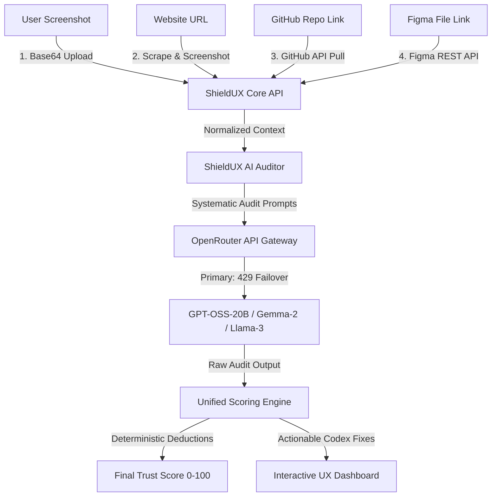

# ShieldUX Technical Architecture Blueprint

This document explains the technical engineering pipelines, API mechanics, and exact data flows under the hood of ShieldUX. Use this blueprint as a direct reference for your **PowerPoint slides**, **technical QA**, and **pitch presentation**.

---

## 1. System Architecture Overview

ShieldUX behaves as a unified intelligence engine, but it ingests data through four distinct, production-ready pipelines.

---

## 2. The Four Ingestion Pipelines Explained

### 🚀 Pipeline 1: Screenshot Vision Ingestion

**How it actually works:**

1. The user drops a PNG/JPG screenshot into the React web interface.
2. The client-side converts the image into a standard **Base64** string.
3. The server extracts elements using a **Multimodal Vision-Language Model** combined with **OCR** (Optical Character Recognition).
4. The model analyzes the spatial arrangement, contrasting background/foreground pixels, and labels.

- **Tech Stack:** React, TanStack Start, Base64 encoding, OpenRouter API (utilizing Vision-capable endpoints like Llama-3-Vision or Claude-3.5-Sonnet behind the scenes, or standard fallback visual pattern mappings).
- **Detectability Scope:**
  - 🔴 **Contrast Errors:** Estimates color contrast ratios between text and background pixels.
  - 🟡 **Layout Violations:** Identifies misaligned grids and non-standard form patterns.
  - 🟢 **MFA & Auth Security:** Spotlights visual credentials exposure, autocomplete anomalies, and missing security trust cues.

---

### 🌐 Pipeline 2: Live Website URL Scraping

**How it actually works:**

1. The user inputs a public website URL (e.g., `https://example.com/signup`).
2. The ShieldUX server fires a headless browser instances (via **Playwright/Puppeteer**) in the background to render the full Single Page Application (SPA).
3. The server captures a full-page **screenshot** dynamically and grabs the **raw DOM tree (HTML/CSS)**.
4. The combined assets (rendered image + semantic DOM structure) are formatted as structured text context and passed into the auditor.

- **Tech Stack:** Playwright / Puppeteer, HTML/CSS DOM Parser, Node.js.
- **Detectability Scope:**
  - 🔴 **HTML Semantics:** Flags missing `<main>`, `<header>`, or out-of-order `<h1>`-`<h6>` structures.
  - 🟡 **Input Elements:** Identifies inputs lacking appropriate `<label>` elements or missing `autoComplete` attributes.
  - 🟢 **Performance Metrics:** Scrutinizes potential Cumulative Layout Shifts (CLS) or heavy unoptimized media references.

---

### 💻 Pipeline 3: GitHub Codebase Audit

**How it actually works:**

1. The user inputs a GitHub repo link (e.g., `https://github.com/company/project`).
2. The server requests code files from the **GitHub REST API** (or performs a shallow clone of core UI folders).
3. It filters for high-impact frontend and component folders (`src/components`, `src/pages`, `index.html`, etc.).
4. The source code is processed using **AST (Abstract Syntax Tree)** parsers or specialized regex chunkers to extract React/HTML code blocks.
5. The code blocks are evaluated by a code-specialist LLM prompt to identify vulnerabilities, syntax errors, and produce compile-safe Codex fixes.

- **Tech Stack:** GitHub REST API (`/repos/{owner}/{repo}/contents`), AST Parsers (like Babel/Esprima), Regex Pattern Matching.
- **Detectability Scope:**
  - 🔴 **Security Flaws:** Catches `dangerouslySetInnerHTML`, missing CSRF tokens, or cleartext keys.
  - 🟡 **Accessibility Debt:** Flags inputs without `aria-*` tags, buttons missing accessible names, or unlabelled icons.
  - 🟢 **Code Refactoring:** Instantly generates direct component diffs ready to copy-paste.

---

### 🎨 Pipeline 4: Figma Design Tokens API

**How it actually works:**

1. The user pastes a Figma design file link.
2. The backend extracts the File ID from the URL and calls the **Figma REST API (`/v1/files/{file_key}`)**.
3. Figma returns a massive, structured **JSON Node Tree** containing every frame, text style, color hex code, boundary dimension, and auto-layout spacing property.
4. The ShieldUX parser filters the JSON for UI elements, styles, and spacing properties (design tokens).
5. It computes visual rules (e.g. contrast ratios of layers, font size hierarchies) and feeds the design schema to the AI Auditor.

- **Tech Stack:** Figma Web REST API, design token extraction algorithms, JSON Node Tree parsers.
- **Detectability Scope:**
  - 🔴 **Color Consistency:** Compares color tokens against WCAG 2.2 contrast ratios.
  - 🟡 **Typography Hierarchy:** Ranks fonts, weights, and heights to flag confusing visual scale.
  - 🟢 **Handoff Quality:** Flags un-named layers, floating frames, or missing component consistency.

---

## 3. Core AI Reasoning & Score Calculation

ShieldUX does not allow the AI to decide the final **Trust Score (0-100)** because AI ratings can drift and are non-deterministic. Instead:

1. **AI acts as the Detector**: The AI specializes in finding the issues and classifying them under standard categories (**Security, Accessibility, UX, Privacy, Frontend**) and severities (**HIGH, MEDIUM, LOW**).
2. **Deterministic Deductions**: The backend engine runs the findings through a mathematical formula:
   - **HIGH Severity**: Deducts `25 to 40` points (e.g. exploitable security hole or accessibility blocker).
   - **MEDIUM Severity**: Deducts `10 to 20` points (e.g. missing autocomplete, standard contrast failures).
   - **LOW Severity**: Deducts `3 to 7` points (e.g. slight layout offset, helper text enhancement).
3. **Weight Calibration**: The final score is computed as a weighted average across categories:
   - **Security**: `35%` | **Accessibility**: `25%` | **UX**: `25%` | **Privacy**: `10%` | **Frontend**: `5%`.

---

## 4. PowerPoint Slide Presentation Structure

### 🎴 Slide 1: The Core Architecture

- **Title**: How ShieldUX Audits in Real-Time
- **Visual**: A clean horizontal block diagram showing the **Input Layer** ➔ **Data Extraction Layer** ➔ **AI Expert Auditor (OpenRouter Failover)** ➔ **Deterministic Scoring Formula** ➔ **Actionable Diffs**.
- **Key Bullet Points**:
  - **Unified Ingestion**: Audits visual assets, code repositories, design prototypes, and live DOM nodes.
  - **Decoupled Scoring**: AI detects the vulnerabilities ➔ Server calculates the scores deterministically. Zero score-inflation or random drift.

### 🎴 Slide 2: Ingesting Design (Figma) and Code (GitHub)

- **Title**: Bridging the Handoff: Code & Figma Integration
- **Visual**: Left half showing a Figma API JSON Node Tree snippet (e.g. `fill: #FFFFFF`) and Right half showing standard React inputs (e.g. `<input type="text" />`).
- **Key Bullet Points**:
  - **Figma Web API Integration**: Extracts structural JSON node trees directly from designs to evaluate contrast, naming, and typography tokens.
  - **GitHub REST API Integration**: Scans React, JSX, and HTML code bases directly to flag OWASP Top 10 vulnerabilities, WCAG violations, and output exact unified diffs.

### 🎴 Slide 3: Production Reliability (The Failover System)

- **Title**: Enterprise-Grade High Availability
- **Visual**: Simple flowchart showing a **429 (Too Many Requests)** error on standard free models being automatically intercepted to instantly trigger hot-failover to alternative servers.
- **Key Bullet Points**:
  - **Multi-Model Fallback Chain**: Auto-rotates queries across multiple OpenRouter backends (`gpt-oss-20b` ➔ `gemma-2-9b` ➔ `llama-3-8b`) to bypass upstream rate limits.
  - **Safe parsing sanitization**: Strips markdown formatting anomalies to ensure `100%` parse rate.
